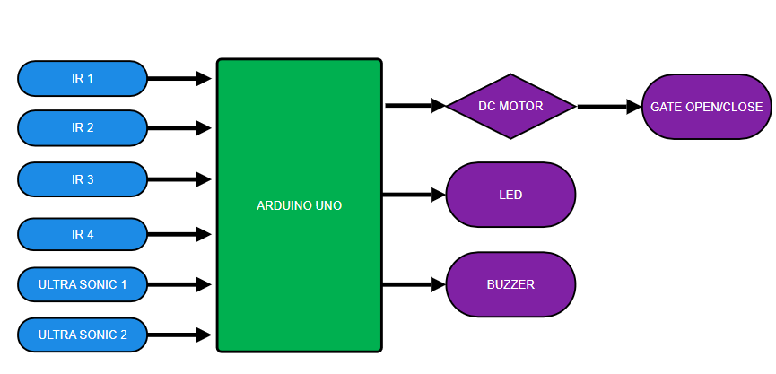

# 🚦 IoT-Based Railway Disaster Management System

A smart safety system that automates railway crossing gates and sends alerts to prevent train accidents using IR, ultrasonic sensors, and Arduino-based control logic.

---

## 🧠 Problem Statement

Railway accidents, especially at unmanned crossings and track change loops, continue to cause thousands of injuries and deaths each year due to delayed or missing alerts. Human-operated systems often fail to alert drivers or close gates on time.

---

## 🎯 Objective

To reduce railway accidents by:
- Automating gate operation using distance and presence sensors
- Sending early warnings via LEDs and buzzers
- Implementing a double-level train detection logic

---

## 🛠️ Hardware Components Used

| Component          | Quantity |
|--------------------|----------|
| Arduino UNO        | 1        |
| Ultrasonic Sensor  | 1        |
| IR Sensor          | 2        |
| L293D Motor Driver | 1        |
| 16x2 LCD Display   | 1        |
| LED                | 2        |
| Buzzer             | 1        |
| DC Motor           | 1        |
| Breadboard         | 1        |
| Jumper Wires       | –        |

📄 Full list in [`components_list`](components_list)

---
## 🔁 Block Diagram

## 🔧 Working Principle

1. **IR Sensor** detects the presence of the train on the track.
2. **Ultrasonic Sensor** calculates the distance of the approaching train.
3. Arduino UNO processes the data and:
   - Activates buzzer and LED for warnings
   - Sends control signal to L293D motor driver
4. The DC motor opens or closes the gate automatically.
5. The 16x2 LCD displays the status of the train and gate.

---

## 🚨 Features

- ✅ Automatic gate control
- ✅ Early warnings for pedestrians and vehicles
- ✅ Dual-layer train detection logic
- ✅ Eco-friendly and human-error-free operation

## code
 [``](components_list)
